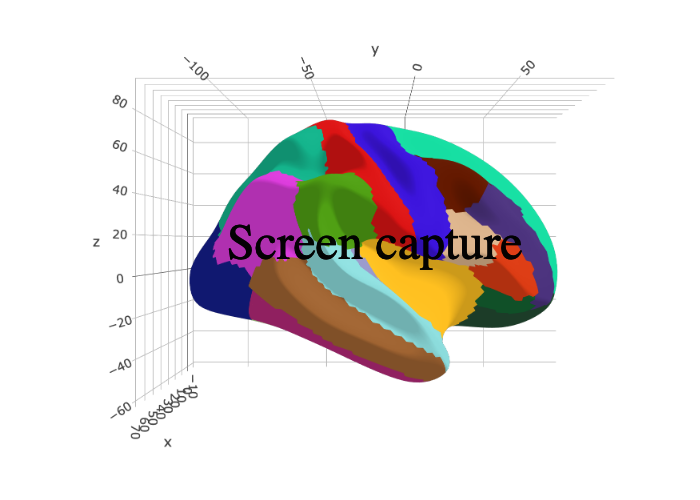

<!-- README.md is generated from README.Rmd. Please edit that file -->

```{r, include = FALSE}
knitr::opts_chunk$set(
  collapse = TRUE,
  comment = "#>",
  fig.path = "man/figures/README-",
  out.width = "100%"
)
```

# ggsegDKT

<!-- badges: start -->
[](https://github.com/LCBC-UiO/ggsegDKT/actions)
<!-- badges: end -->
This package contains dataset for plotting the Shaefer cortical atlas ggseg and ggseg3d. 

## Installation

You can install the released version of ggsegDKT from [GitHub](https://github.com/) with:

``` r
# install.packages("remotes")
remotes::install_github("LCBC-UiO/ggsegDKT")
```

## Example

```{r}
library(ggsegDKT)
```

```{r, fig.height=10}
library(ggseg)

plot(dkt) +
  theme(legend.position = "bottom",
        legend.text = element_text(size = 7)) +
  guides(fill = guide_legend(ncol = 4))
```

```{r "noneval", eval=FALSE}
library(ggseg3d)
library(dplyr)

ggseg3d(atlas = dkt7_3d) %>% 
  pan_camera("right lateral")
```

```{r "orca", include=FALSE}
library(ggseg3d)
library(dplyr)

p <- ggseg3d(atlas = dkt_3d) %>%
  pan_camera("right lateral") %>%
  plotly::add_annotations( text="Screen capture",
                  legendtitle=TRUE, showarrow=FALSE,
                  font = list(color = "#000000b4",
                              family = 'sans serif',
                              size = 50))
plotly::orca(p, "man/figures/README-s7-3d-plot.png")
```

```{r "incl", echo=FALSE}

```

## Code of Conduct

Please note that the ggsegDKT project is released with a [Contributor Code of Conduct](https://contributor-covenant.org/version/2/0/CODE_OF_CONDUCT.html). By contributing to this project, you agree to abide by its terms.
